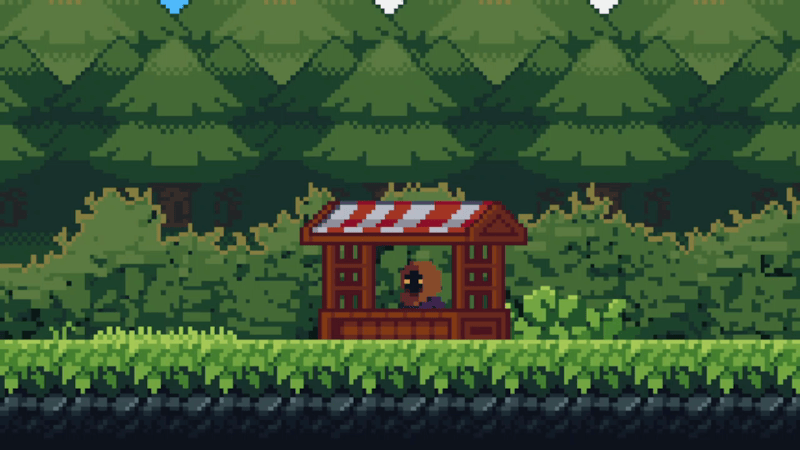
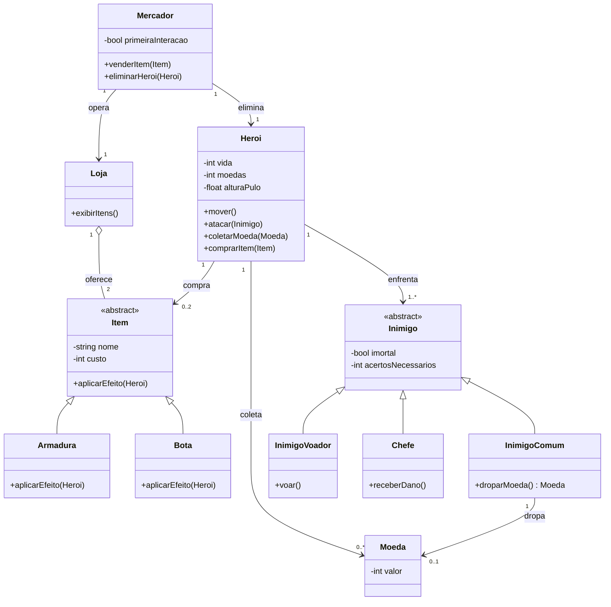

<h1 align="center"> Sem Reembolso </h1>
<p align="center">
<p align="center">
  
</p>
<h3>Integrantes</h3>

• João Pedro Piniani <a href="https://github.com/jppiniani">
  
  </a>
  <a href="https://www.linkedin.com/in/jppiniani/">
  
  </a>
  
• Nicolas Belisário <a href="https://github.com/nicolasbelisario">
  
  </a>
  <a href="https://www.linkedin.com/in/nicolas-belisario-alves/">
  
  </a>

• Lucas Cavalcante <a href="https://github.com/cavalcante-l">
  
  </a>
  <a href="https://www.linkedin.com/in/lucas-cavalcante-barbosa-924b4835b/">
  
  </a>

• Pedro Rodrigues <a href="https://github.com/PedroRodrigues2508">
  
  </a>
  <a href="https://www.linkedin.com/in/pedro-rodrigues-a698ab2a5/">
  
  </a>

• Gabriela Perdigão <a href="https://github.com/gabriela-perdigao">
  
  </a>
  <a href="https://www.linkedin.com/in/gabriela-perdig%C3%A3o-da-silva-094058262/">
  
  </a>

<hr>

<h3>Objetivo Geral</h3>

O objetivo geral deste projeto é desenvolver um jogo de plataforma 2D utilizando a engine Godot 4.6, integrado a um banco de dados relacional via API, para a disciplina de Análise Orientada a Objetos (AOO). O projeto visa demonstrar a aplicação prática de conceitos de programação orientada a objetos na estruturação das entidades do jogo (herói, inimigos, itens, mercador) além de construir uma conexão sólida e simples entre Front-End (Godot), Back-End (API em Python) e Banco de Dados (MySQL).

<hr>

<h3>Sobre o Jogo</h3>
'Sem Reembolso' é um jogo de plataforma onde um herói recém-chegado a um novo local é manipulado por um NPC (Mercador) para realizar a tarefa de destruir um inimigo específico (Chefe) e obter uma recompensa. No final da partida, o jogador é morto pelo Mercador e os itens comprados por ele durante a jornada são revendidos a um próximo jogador em uma nova tentativa. O jogo recebeu esse nome visto que se trata de uma compra "infeliz" do Herói.
<br>
<b>Mecânicas Principais:</b>

- **Ciclo de Progressão:** O jogador coleta moedas derrotando inimigos comuns no 'CENÁRIO 2' para comprar os itens na loja. No penúltimo cenário o Herói poderá enfrentar o Chefe e finalmente o derrotar. Após digitar seu nome, o jogador deve continuar para o 'CENÁRIO 4'. Neste último local, o Mercador irá trair o personagem, matando-o, furtando seus itens e finalizando o jogo.
  
- **Sistema de Loja e Buffs:** O lojista recomendará o Herói a comprar os itens 'ARMADURA' e 'BOTA'. O primeiro dobrará a vida do personagem e o segundo aumentará a distância do pulo do personagem.
  
- **Backtracking e Evolução de Dificuldade:** Após a compra na loja, o personagem retornará ao segundo cenário, porém este irá receber uma atualização visual e comportamental (além dos inimigos anteriores aparecerem novamente, aparecerão novos inimigos voadores). Todos estes inimigos agora serão impossíveis de serem derrotados, cabendo ao jogador desviar deles.
  
- **Sistema de Herança Assíncrono:** Caso o jogador ou outra pessoa iniciar uma nova tentativa, os nomes dos dois itens na loja do Mercador poderão receber o nome do jogador anterior (Exemplo: Bota do João, Armadura do João).
  
- **Leaderboard Global:** O jogo conta com um leaderboard no menu principal, ranqueando as partidas dos jogadores conforme o tempo de conclusão.


<b>Lógica Banco de Dados e API:</b>
  <br>
  <p align="center">
  
</p>
<br>
<br>
A comunicação segue uma arquitetura cliente-servidor: o jogo (Godot) atua como
cliente e conversa com uma <b>API em Python (Flask)</b>, que por sua vez é a única
camada que acessa o banco <b>MySQL</b>. Toda a troca de dados é feita em formato
<b>JSON</b>, mantendo o front-end desacoplado da persistência.

O banco é composto por quatro tabelas:

- <b>JOGADOR</b> — guarda o jogador, identificado por um <code>nickname</code> único.
- <b>RUN</b> — cada partida concluída, com o <code>tempo</code> de conclusão (usado no ranking).
- <b>ITEM</b> — catálogo fixo dos equipamentos (Bota e Armadura), com nome padrão e preço.
- <b>ITEM_has_RUN</b> — tabela associativa (N:N) que registra quais itens pertenceram a quais runs.

A lógica do jogo gira em torno de dois momentos de comunicação com a API:

<b>1. Início da partida (leitura / GET):</b> ao abrir a loja, o jogo pergunta à API
quais são os nomes atuais dos itens. O "nome do dono" <b>não é um campo armazenado</b>:
ele é derivado por uma junção <code>ITEM → ITEM_has_RUN → RUN → JOGADOR</code>, buscando
o último jogador que possuiu aquele item. Se não houver dono anterior, usa-se o nome
padrão (ex.: "Bota do Cavaleiro Traído").

<b>2. Fim da partida (escrita / POST):</b> quando o Mercador mata o Herói no Cenário 4,
o jogo envia um <b>único POST</b> com o nickname, o tempo e os itens possuídos. A API então:
busca ou cria o jogador pelo nickname (reaproveitando o ID se já existir); insere a nova
RUN no ranking; e, havendo itens, insere os registros em ITEM_has_RUN — efetivando a herança.

É exatamente essa herança que dá nome ao jogo: na próxima tentativa, a consulta do passo 1
encontrará o dono anterior e a loja exibirá "Bota do João", "Armadura do João" e assim por diante.
O <b>leaderboard</b> do menu principal usa uma terceira consulta (GET), listando as runs
ordenadas pelo menor tempo.

<br>
<p align="center">
  
</p>
<hr>
<br>

<b>Diagrama de Classes de Domínio</b>

<br>
<h3>Como Rodar o Projeto</h3>

A arquitetura tem 3 camadas que precisam estar no ar, nesta ordem: **MySQL → API (Python/Flask) → Jogo (Godot)**.

<b>Pré-requisitos</b>

- **MySQL Server 8.x** (o Workbench é opcional, só ajuda a visualizar)
- **Python 3.10+**
- **Godot 4.6** — necessário <b>apenas</b> para rodar a partir do código-fonte (Opção B). Para só jogar, use o executável (Opção A) e o Godot não é preciso.

<b>1. Banco de dados</b>

Importe o schema (cria o banco `game_lambda`, as tabelas e os itens iniciais):

```bash
mysql -u root -p < backend/schema.sql
```
> Ou pelo Workbench: <b>File → Open SQL Script</b> → `backend/schema.sql` → botão <b>Execute</b> (raio).

<b>2. API (back-end)</b>

```bash
cd backend
python -m venv venv
venv\Scripts\activate          # Windows  (Linux/Mac: source venv/bin/activate)
pip install -r requirements.txt
```

Crie o arquivo de credenciais a partir do modelo e edite com a sua senha do MySQL:

```bash
copy .env.example .env         # Windows  (Linux/Mac: cp .env.example .env)
```

Abra o `.env` e troque o valor de `DB_PASSWORD` pela senha do seu MySQL. Depois suba a API:

```bash
python app.py
```

A API fica disponível em `http://127.0.0.1:5000`. Deixe esse terminal aberto.

> ⚠️ O `.env` contém a senha e <b>não vai para o Git</b> (está no `.gitignore`). Cada pessoa cria o seu a partir do `.env.example`.

<b>3. O Jogo</b>

- <b>Opção A — Executável (não precisa do Godot):</b> rode o arquivo `build/SemReembolso.exe`. Ele procura a API em `127.0.0.1:5000`, então garanta que os passos 1 e 2 estão rodando. (Detalhes em [`build/README.md`](build/README.md).)
- <b>Opção B — A partir do código (precisa do Godot 4.6):</b> abra a pasta `game-lambda/` no Godot 4.6 e clique em <b>Play</b> (F5).

> Se a loja mostrar os nomes padrão ("Bota do Herói Traído") em vez dos nomes herdados, ou o leaderboard ficar carregando, é sinal de que a API não está acessível — confira se o `python app.py` está rodando.

<hr>

<h3>Ferramentas e tecnologias utilizadas</h3>

- **Front-End / Engine:** Utilização da engine Godot 4.6. O Godot possui uma vasta gama de ferramentas nativas e uma interface visual que facilita a manipulação do sistema de Cenas e Nós, tornando a aplicação de conceitos de POO organizada e intuitiva.
- **Artes Visuais:** O software LibreSprite foi utilizado para criar e animar sprites (imagens bidimensionais 2D).
- **Back-End (API):** Python (Flask) para a comunicação do jogo com o banco.
- **Banco de Dados:** Armazenamento em SGBD Relacional (MySQL).
- **Versionamento:** Git e GitHub.

<p align="center">
  
  
  
</p>

<hr>
<!-- (Aqui eu vou mudar pro PDF atualizado) -->
<h3>Documentação</h3>

[PDF do Projeto](https://github.com/user-attachments/files/29115666/pdf.pdf)


